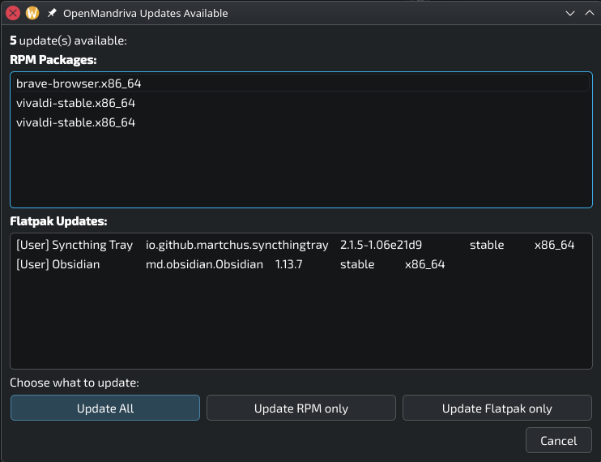
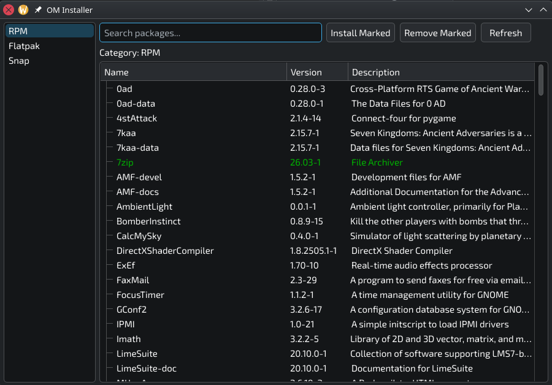

# OpenMandriva Updater and Installer 

This is a operating system updater and installer for the OpenMandriva distribution. It's small, simple, and should be able to run even on low memory systems. 

## Updater

The updater sits in your system tray: 

 

When you click the icon, you can see what needs updating: 

 

It can update both RPMs and Flatpaks (Snaps update automatically). 

## Installer 

The installer is a simple interface for searching for and installing RPM, Flatpak, and Snap packages: 

 

Search for a package, right-click to mark packages for installation or removal, and click Install Marked or Remove Marked to install or remove. Packages already installed appear in green. 

Flatpaks and Snaps can be searched for separately by clicking the categories on the left. 